# BTS 프로그램 업데이트 가이드

> 뉴웨어 교육 자료 · 2026. 07. 23
>
> 7.6 버전 → 8.0 버전 업데이트 | 수동 및 자동 업데이트 방법

---

## 시작 전 주의사항 및 준비사항

1. **중위기 LP / SP / GW 정보 확인** — IP 앞의 세 자리가 모두 `192.168.1.xxx` 인지 확인합니다.
2. **BTS Server 서비스 확인** — 서버는 데이터와 직결된 자료이므로, 서버 파일 생성 경로가 어디로 되어 있는지 확인한 후 서버 업데이트를 진행해야 합니다.
3. **서버 업데이트 시 이더넷 중지 확인** — 실험이 진행 중인 상태에서 데이터 문제가 발생하는 것을 방지하기 위해, 이더넷을 중지했는지 확인합니다.

---

## 1. 진행 전 서버 파일 백업

업데이트를 시작하기 전에 반드시 서버 파일을 백업합니다.

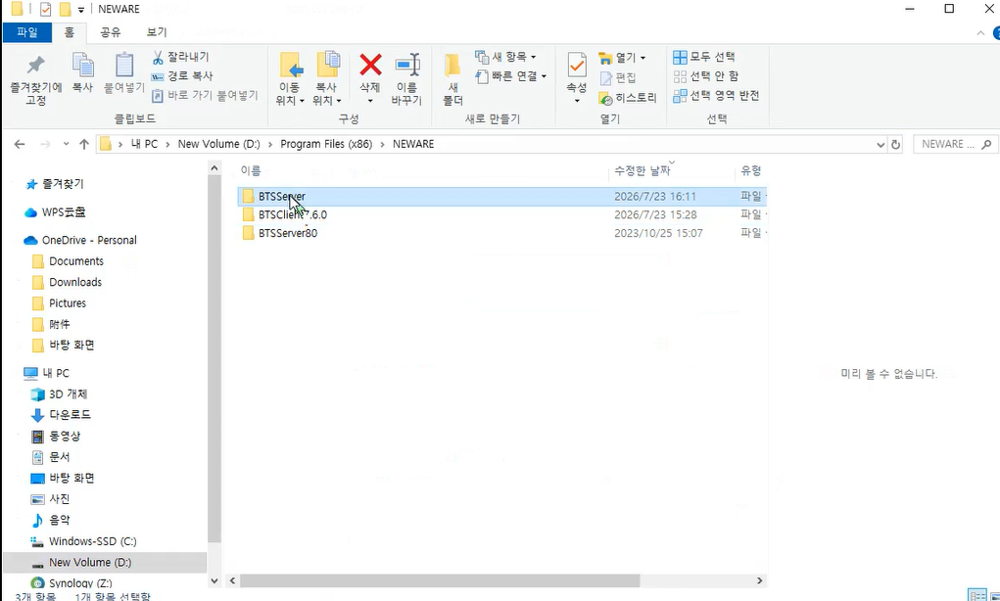

## 2. 진행 중인 실험 중지

실험이 진행 중이면 멈춘 후 진행합니다. 실험 중인 데이터가 없으면 그대로 진행합니다.

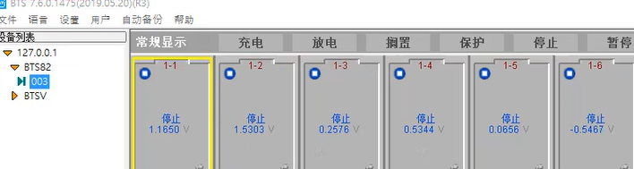

## 3. 이더넷 '사용 안 함'으로 변경

실험 중인 데이터 보존을 위한 조치입니다. 진행 중인 실험이 없으면 이더넷 종료 작업은 생략합니다.

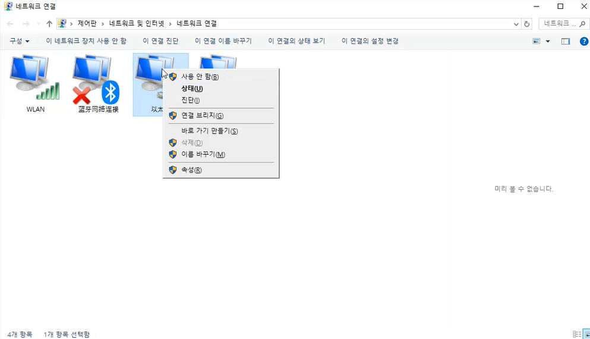

## 4. 기존 서버 파일 백업 및 파일명 변경

새로 설치되는 파일과 이름이 충돌하면 데이터가 손상될 우려가 있습니다.

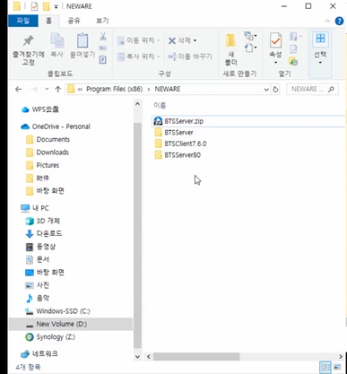

## 5. 업데이트 폴더에서 서버 업데이트 진행

7.6 버전에서 8.0 버전으로 넘어가는 경우, 해당 프로그램이 담긴 폴더에서 서버 업데이트를 진행합니다.

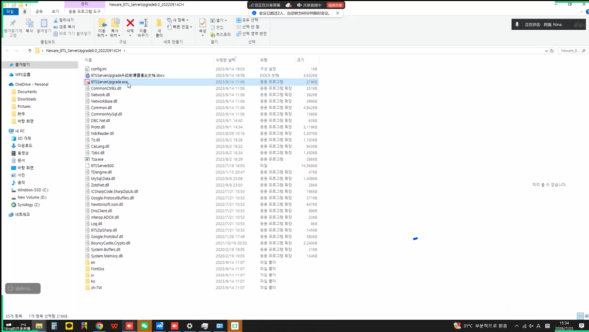

## 6. 설치 경로 확인 후 설치

기존 서버 파일과 이름이 달라야 하며, 기존 서버가 저장되어 있는지 반드시 확인합니다. 확인되었으면 경로를 지정한 후 설치합니다.

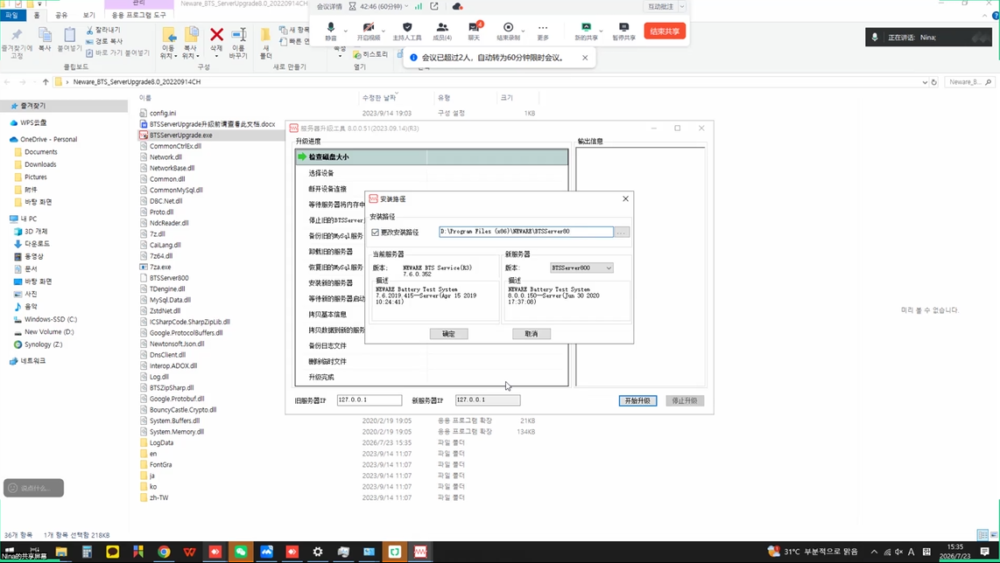

## 7. 서버 업데이트 완료 확인

정상적으로 끝나면 아래와 같은 화면이 표시됩니다. (7.6 → 8.0 서버 업데이트 완료)

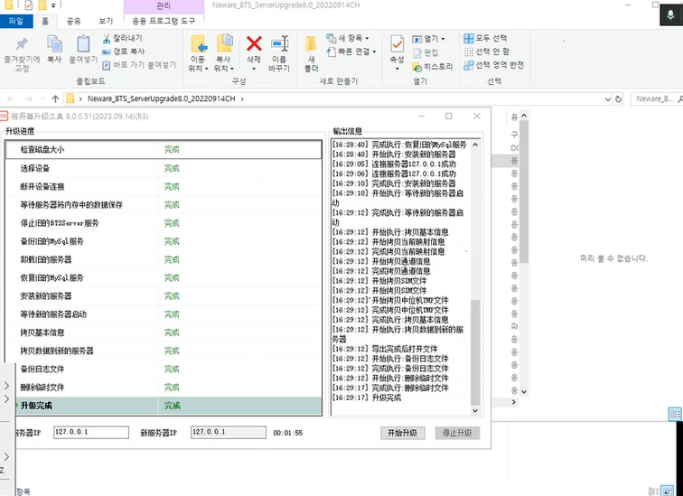

## 8. 클라이언트 설치 — 8.0 하위 버전 먼저

8.0의 낮은 버전을 먼저 설치합니다. 압축 해제 후 셋업 파일을 실행하여 클라이언트를 설치합니다. (예: 2022년 버전을 먼저 설치한 후 확인)

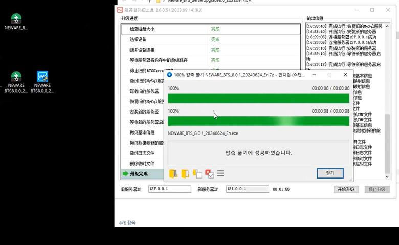

## 9. 헬프(Help) 메뉴에서 업데이트 클릭

7.6에서 8.0(구버전) 설치가 완료되었으면, 8.0에서 8.0으로의 업데이트는 헬프 메뉴에서 '업데이트'를 클릭합니다.

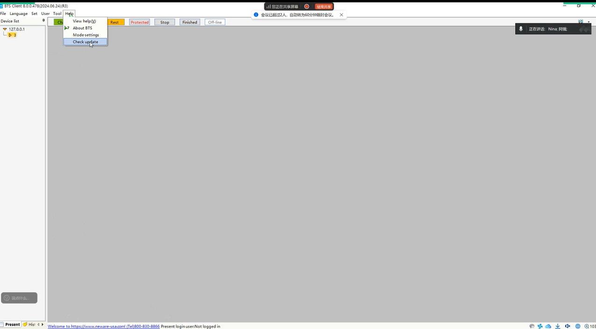

## 10. 업데이트 목록 확인 및 순차 진행

업데이트 가능한 최신 버전이 있으면 아래와 같이 표시되며, 하나씩 업데이트를 진행합니다. 서버를 먼저 업데이트했으므로 클라이언트부터 업데이트합니다.

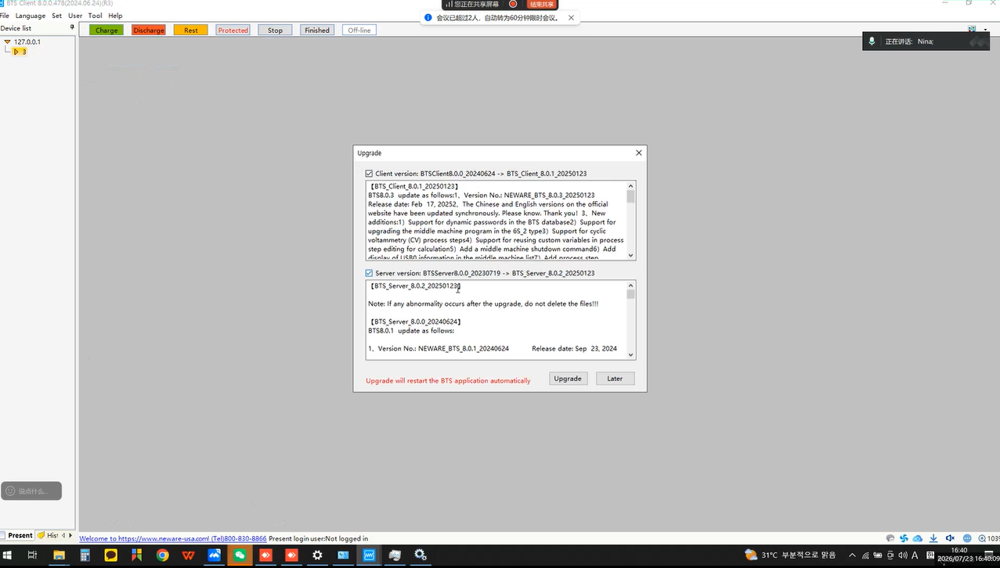

## 11. 클라이언트 업데이트 진행

업데이트 완료 후 BTS 재실행이 필수입니다.

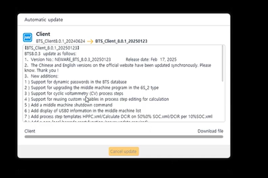

### 클라이언트 업데이트 완료 확인

최신 버전이 없으면 아래와 같이 표시됩니다. 이어서 나머지 서버 업데이트를 진행합니다.

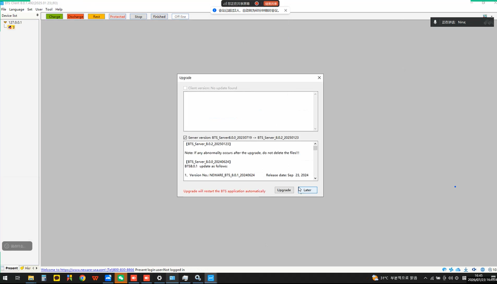

### 서버 업데이트 진행 과정

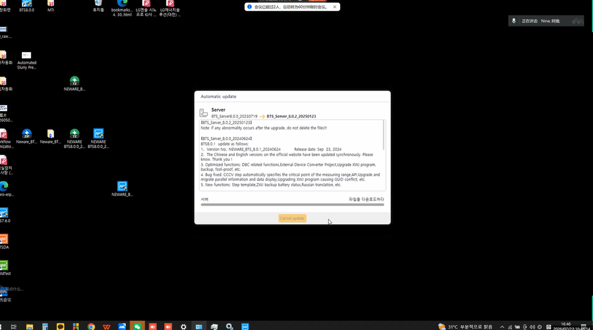

### 업데이트 후 최종 확인

모든 업데이트가 완료된 후, 진행 중이던 채널 데이터가 정상적으로 불러와졌는지 확인이 필요합니다.

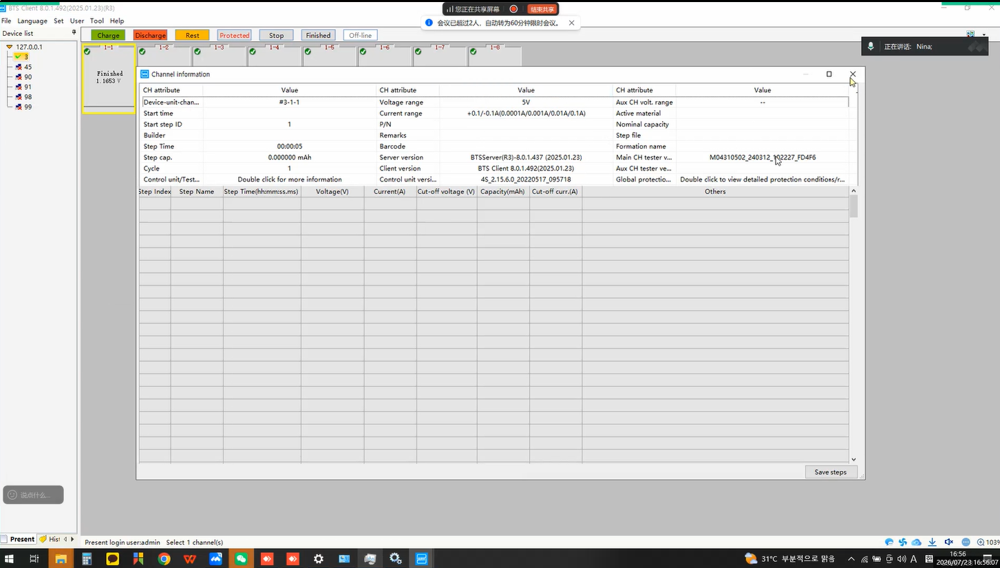

---

## 마무리 정리

* **오래된 버전(7.6)에서 업데이트할 때** — 1 ~ 8번 항목을 참조하여 진행합니다.
* **8.0에서 8.0으로 업데이트할 때** — 8번 항목 이후부터 참조하여 진행합니다.
* **공통 조건** — 실험이 진행 중일 때 업데이트하는 경우, 실험을 멈추고 이더넷 통신을 반드시 중지합니다.
