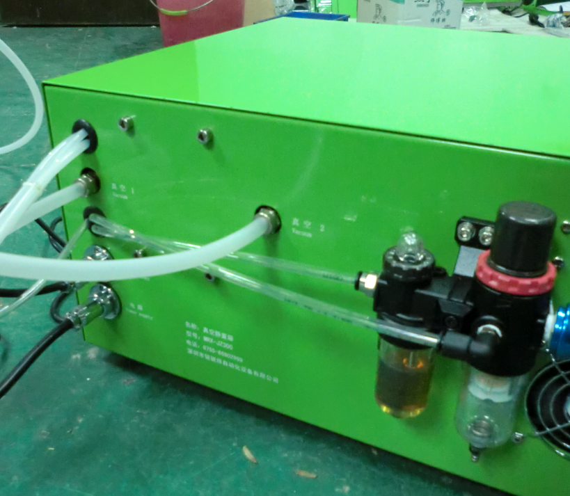

# 3-2. 유틸리티 연결

## 배관 및 전선 연결

배관과 전선은 표시된 **식별 코드**에 따라 정확하게 연결합니다.

| 유틸리티 | 사양 | 연결 방법 |
| --- | --- | --- |
| 전원 | 220V / 50Hz | 식별 코드에 따라 연결 |
| 압축 공기 | 0.5 ~ 0.7MPa | 식별 코드에 따라 연결 |
| 진공 | Φ10 튜브 | 진공관으로 연결 (진공 펌프는 별도 준비) |

## 글러브박스 설치 시

장비가 글러브박스에 설치되는 경우:

1. **KF40 클램프**로 밀봉합니다.
2. **에폭시 수지**로 실란트 처리합니다.

---

*SINOPRO · SP-YF200 Vacuum Pre-sealing Machine · User Manual*
