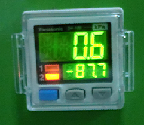

# 4-1. 사용 전 준비사항

## 초기 점검 항목

1. 유틸리티(전원·에어·진공) 연결 상태를 확인합니다. ([3-2. 유틸리티 연결](../3-install/3-2-utility.md) 참조)
2. 배터리(제품) 투입 위치를 정확하게 조정합니다.
3. 전원을 켜고 다음 설정값을 확인합니다. **출고 시 기본값이 세팅되어 있습니다.**
   * 에어 압력값 · 밀봉 온도값 · 밀봉 시간값 · 진공도값 · 커버 개방 압력값

## 파라미터 설정

| 항목 | 설명 |
| --- | --- |
| 상부 온도 설정 | 상부 실링 나이프의 가열 온도 설정 |
| 하부 온도 설정 | 하부 실링 나이프의 가열 온도 설정 |
| 실링 시간 | 상하 실링 나이프의 밀착 유지 시간 설정 |
| 실링 지연 시간 | 진공도가 설정값(P1) 도달 후 실링까지의 지연 시간 |
| 커버 개방 지연 시간 | 가스 주입 압력이 설정값(P2) 도달 후 커버 개방까지의 지연 시간 |

## 진공 설정값 입력 (P1)

* 게이지 상단은 **진공 측정값**, 하단은 **진공 설정값**입니다.
* 《파란색 버튼》을 눌러 **P1** 항목이 표시되면 해당 값이 진공 설정값입니다.
* 《UP》《DOWN》으로 원하는 진공 값을 설정합니다.
* 설정 범위는 일반적으로 **-85kPa ~ -90kPa**입니다.
* 진공 공정 중 챔버 내부 진공도가 설정값에 도달하면 신호가 출력되어 다음 공정이 자동으로 시작됩니다.

## 보충 압력 설정 (P2)

* 《파란색 버튼》을 눌러 P1이 표시된 후 **P2**가 표시되면, P2 값이 보충 압력 설정값입니다.
* 《UP》《DOWN》으로 원하는 압력을 설정합니다.
* 설정 범위는 일반적으로 **-3kPa ~ 0kPa**입니다.
* 보충 압력이 설정값에 도달하면 신호가 출력되어 상부 커버 개방 공정이 시작됩니다.


**작성 필요** — 샘플/지그 세팅 방법(파우치 셀 정렬 기준, 지그 교체 방법)을 사진과 함께 추가해 주세요.


---

*SINOPRO · SP-YF200 Vacuum Pre-sealing Machine · User Manual*
