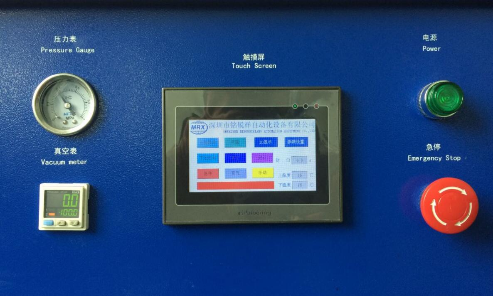

# 4-2. 장비 조작

## 자동 운전 절차

1. **수동 모드를 자동 모드로 전환**합니다.
2. 온도가 설정값에 도달하면 제품을 투입합니다.
3. 양손으로 장비 전면 하단 좌우의 **시작 버튼을 동시에** 누릅니다.
4. 상부 커버가 자동으로 하강하여 하판의 O링을 눌러, 제품이 진공 밀봉된 환경에서 작업되도록 합니다.
5. 자동으로 진공이 시작되며, 설정된 진공도(P1)에 도달하면 밀봉이 시작됩니다.
6. 히터가 하강하여 밀봉을 수행하며, 타이머가 작동되어 설정된 시간만큼 밀봉이 진행됩니다.
7. 밀봉이 완료되면 챔버 내부에 가스를 주입하여 진공을 해제합니다.
8. 챔버 내부 압력이 설정값(P2)에 도달하면 커버가 자동으로 열립니다.
9. 제품을 꺼내면 작업이 완료됩니다.


운전 중에는 챔버 내부와 동작부에 손을 넣지 마세요. 이상 발생 시 즉시 **비상 정지** 버튼을 누르세요.


## 제어 패널 스위치

제어 패널 각 스위치의 기능은 [1-2. 장치 구성](../1-device-info/1-2-components.md)의 표를 참조하세요.

---

*SINOPRO · SP-YF200 Vacuum Pre-sealing Machine · User Manual*
