# 챔버 점검 및 컴프레셔 교체 교육

> **SINOPRO** · 교육 자료 · 2026. 08. 05.


본 자료는 챔버(항온) 장비의 점검 방법과 컴프레셔 교체 작업 절차를 설명하는 교육 자료입니다.&#x20;

브레이징·냉매 취급 작업이 포함되므로, 각 단계의 주의사항을 반드시 확인한 후 작업을 진행하세요.


## 기본 점검

1. **일체형 장비 전면 필터**의 청소 상태를 확인합니다.
2. **매니폴드 게이지**를 연결하여 냉매 압력을 확인합니다.
3.  **컴프레셔 이상 여부**를 확인합니다.

    ① 터치패널의 빨간색 버튼을 눌러 장비를 **RUNNING** 상태로 전환합니다.

    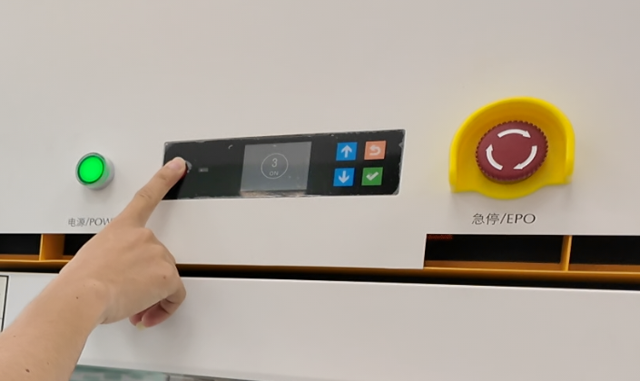

    ② 냉각팬과 컴프레셔의 작동 여부를 확인합니다.

    <table><thead><tr><th width="154">구분</th><th>상태</th></tr></thead><tbody><tr><td>정상 상태</td><td>컴프레셔는 미세한 진동이 발생합니다. 냉각팬은 정상적으로 회전합니다.</td></tr><tr><td>이상 상태</td><td>컴프레셔가 작동되지 않으며 <strong>'딸깍'</strong> 소리만 발생합니다.</td></tr></tbody></table>
4.  **릴레이 단자에 전류가 정상적으로 공급되는지** 확인합니다.

    * 정상일 경우에는 전류값이 안정적으로 측정되어야 합니다.
    * 제어 신호는 정상적으로 출력되지만 컴프레셔가 작동하지 않는 경우에는, 보호회로가 동작하여 전류가 공급되지 않을 수 있습니다.
    * 이 경우에는 기본적으로 **컴프레셔 이상으로 판단하여 교체를 진행**합니다.

    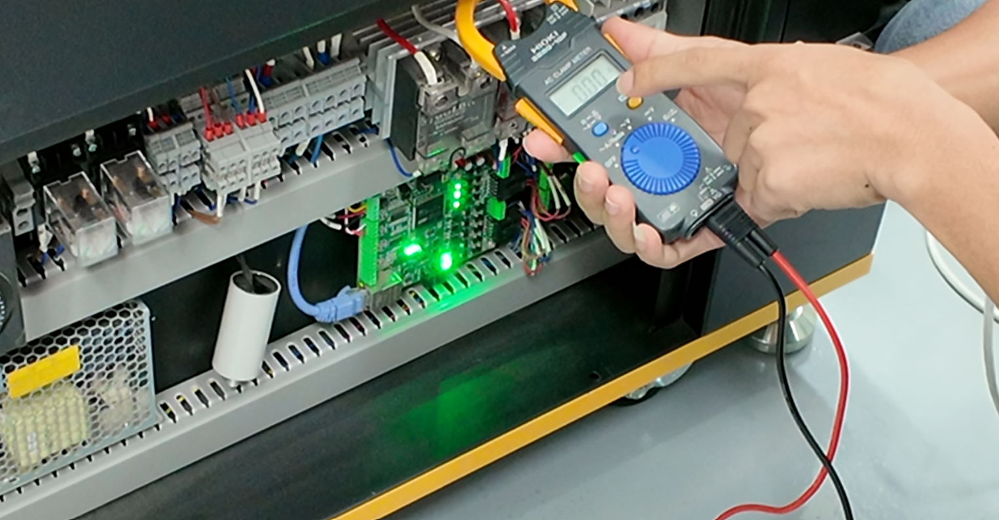

    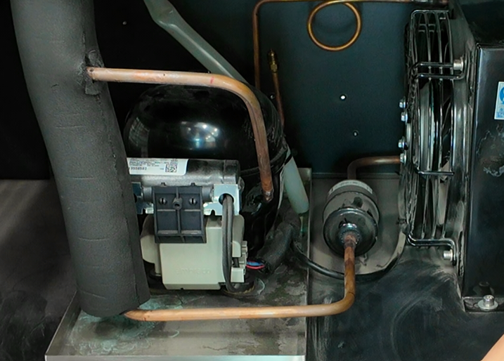

## 컴프레셔 교체 준비물

<table><thead><tr><th width="75" align="center">번호</th><th>부품</th></tr></thead><tbody><tr><td align="center">1</td><td>컴프레셔</td></tr><tr><td align="center">2</td><td>전선단자 세트</td></tr><tr><td align="center">3</td><td>산소용접 세트</td></tr><tr><td align="center">4</td><td>냉매가스</td></tr><tr><td align="center">5</td><td>검은색 보온재</td></tr><tr><td align="center">6</td><td>방염포</td></tr><tr><td align="center">7</td><td>동관 충전 밸브 (Copper Tube Charging Valve)</td></tr><tr><td align="center">8</td><td>동관 커터/동관 벤더</td></tr><tr><td align="center">9</td><td>산소 용접봉</td></tr><tr><td align="center">10</td><td>토치</td></tr><tr><td align="center">11</td><td>동관 확장기</td></tr></tbody></table>

**전선단자 세트**

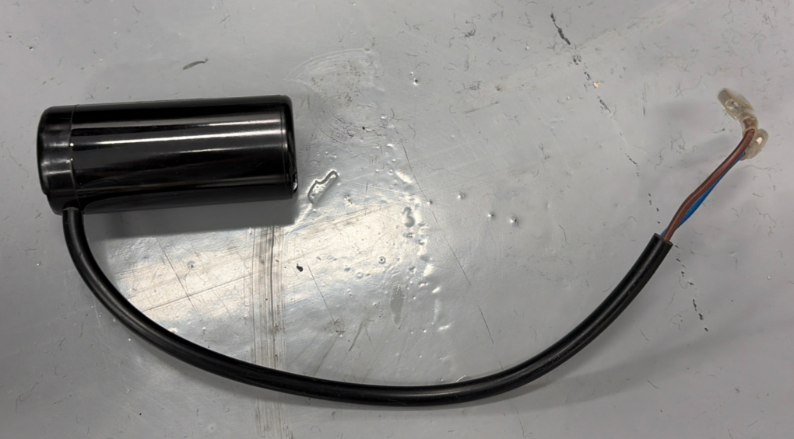

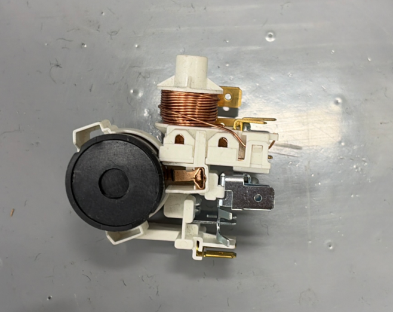

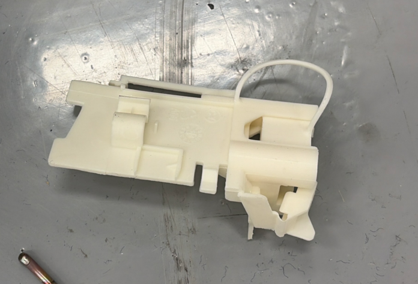

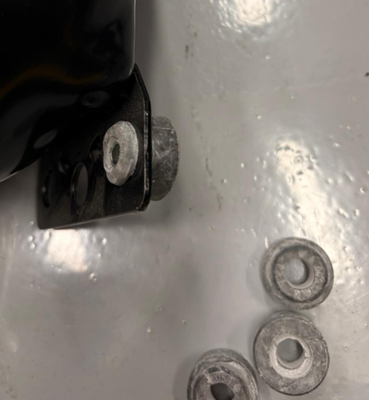

## 컴프레셔 교체 절차



## 단자 커버 및 보온재 제거

컴프레셔 후면의 **단자 커버**를 분리합니다.

동관에 감겨 있는 **검은색 보온재**를 제거합니다.



## 기존 및 새 컴프레셔 비교

새 컴프레서와 기존 컴프레서를 비교하여 다음 사항을 확인합니다.

* 동관 연결 위치
* 설치 방향 및 배치 가능 여부



## 동관 분리 방법 결정

비교가 완료되면 동관의 분리 방법을 결정합니다.

* **방법 A** — 산소용접기를 이용하여 동관 접합부를 가열하여 분리합니다.
* **방법 B** — 동관을 커터기를 이용하여 절단합니다.

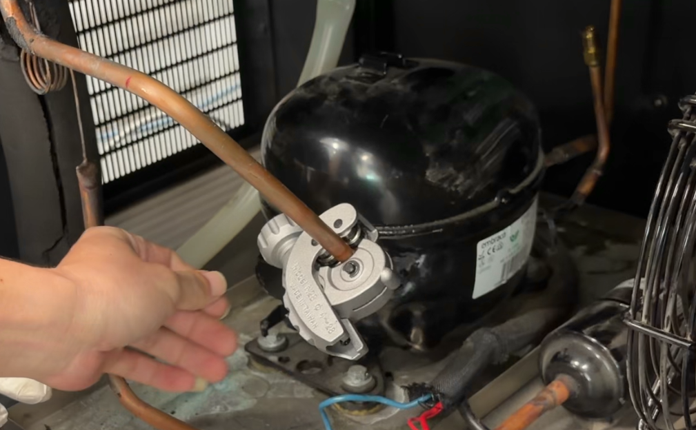

※ 사진은 **동관 절단 방식**을 예시로 보여줍니다.



## 고정 볼트 분리

컴프레셔를 고정하고 있는 **고정 볼트**를 모두 분리합니다.



## 동관 충전 밸브

새 컴프레셔에 **동관 충전 밸브**를 장착합니다.


**주의사항** — 작업 전에 반드시 충전 밸브 내부의 **밸브 코어**를 먼저 분리한 후 작업을 진행해야 합니다. 밸브 코어를 분리하지 않고 동관을 가열할 경우, 고온으로 인해 밸브 코어가 손상될 수 있으며 이후 냉매를 정상적으로 충전할 수 없습니다.


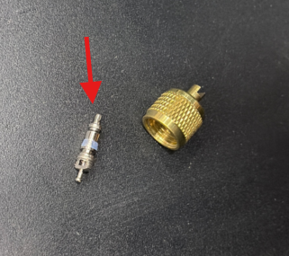



## 동관 절단 및 용접

기존 동관의 길이와 직경을 확인한 후, 필요한 만큼 절단하여 용접을 진행합니다.

<figure>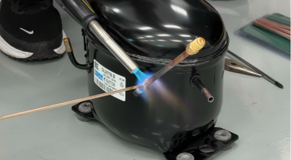<figcaption></figcaption></figure>

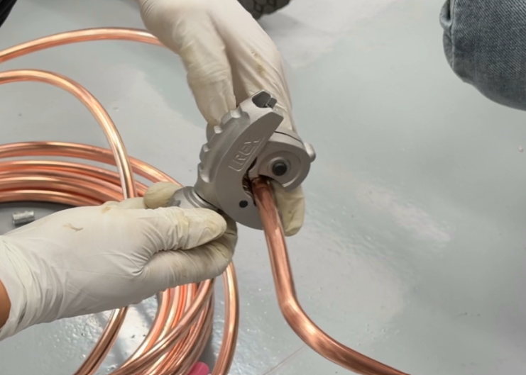

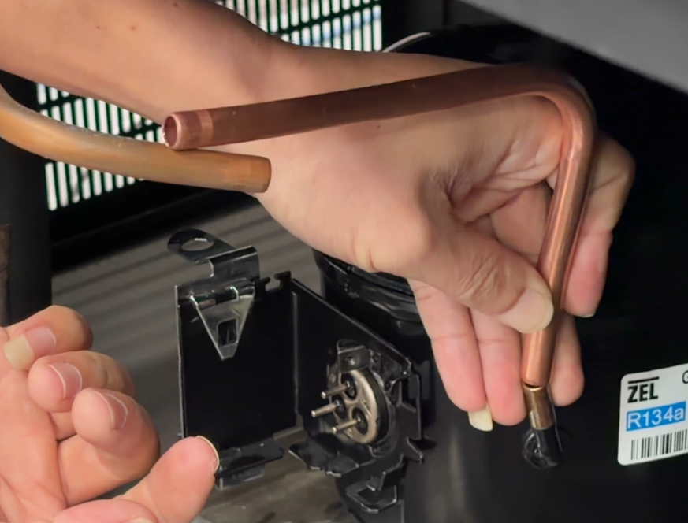

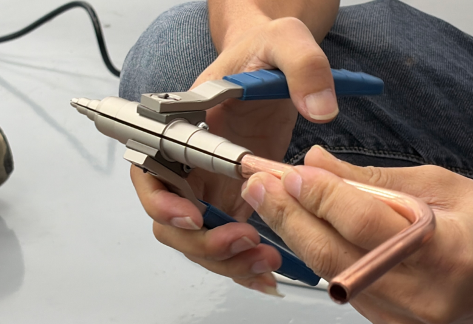

작업 전에 다음 사항을 확인합니다.

* 동관 길이 조정
* 동관 각도 조정
* 확장 필요 여부 확인

필요한 경우 동관을 확관한 후 가열 작업을 진행합니다.


**가열 시 주의사항** — 가장 안쪽 동관을 가열할 때에는 뒤쪽에 **PCB 기판이** 위치하고 있으므로, 불꽃이 기판에 직접 닿지 않도록 용접 각도를 조정하여 작업해야 합니다.


브레이징 토치는 아래 사진과 같은 자세로 잡고 작업합니다.

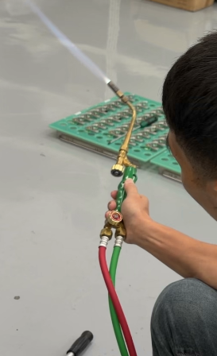

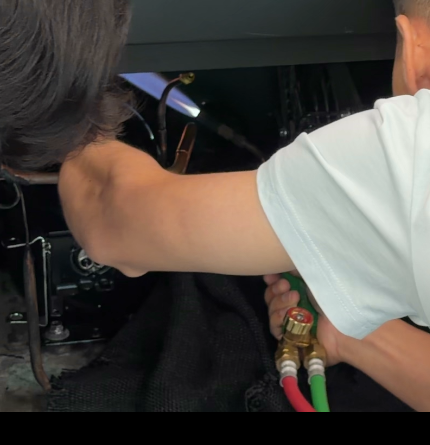

작업자는 가능한 한 **컴프레셔의 오른쪽**에 위치하여 작업합니다.

* 한 손에는 토치를 잡고
* 다른 한 손에는 용접봉을 잡은 상태에서 가열을 진행합니다.



## 용접 부위 냉각

작업이 완료되면 용접 부위에 물을 분사하여 냉각합니다.


**주의사항** — 물을 분사할 때에는 **용접부** 에 직접 물이 들어가지 않도록 주의하십시오.&#x20;

만약 용접이 완전히 되지 않아 미세한 틈이 있는 경우, 물이 동관 내부로 유입될 수 있습니다.




## 컴프레서 재장착

컴프레서를 장비 내부에 다시 장착합니다. 고정 볼트 위치를 맞춘 후 단단히 고정합니다.



## 밸브 코어 재장착

동관 충전 밸브(Service Valve)에 **밸브 코어(Valve Core)** 를 다시 장착합니다.



## 용접상태 확인

용접상태를 다시 확인합니다. 다음 사항을 중점적으로 점검합니다.

* 용접부가 완전히 밀봉되었는지
* 균열 또는 핀홀이 없는지
* 개구부가 남아 있지 않은지



## 냉매 누설 점검

컴프레셔를 교체한 후에는 반드시 용 상태와 냉매 누설 여부를 확인해야 합니다. 이를 위해 **매니폴드 게이지**를 연결하여 점검을 진행합니다.

<figure>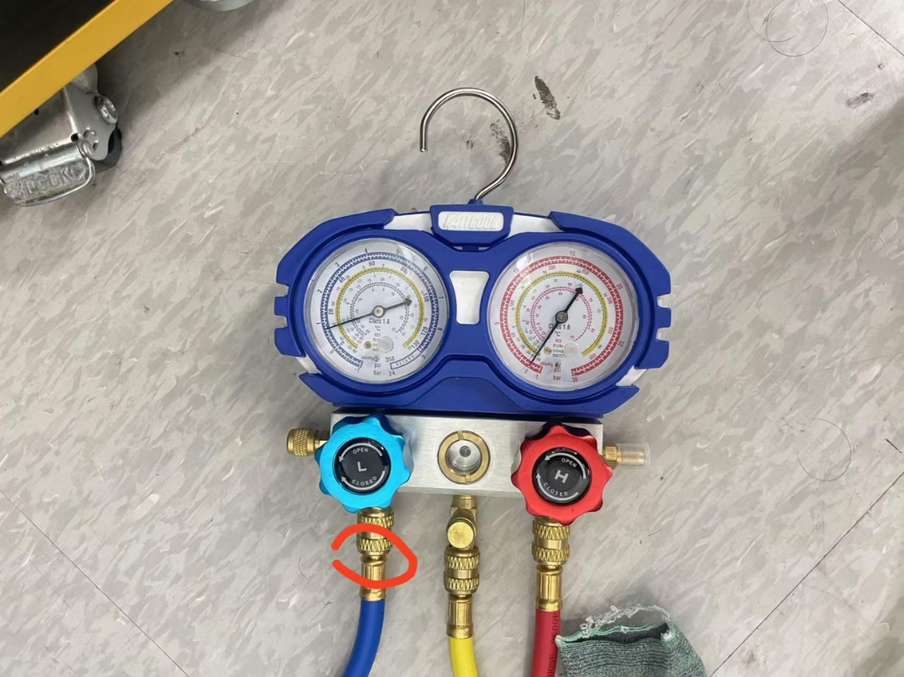<figcaption></figcaption></figure>

### 연결 방법

① 니들 밸브(Service Valve)에 **저압 게이지(파란색)** 를 연결합니다.

② **노란색 호스**를 냉매 용기에 연결합니다.


**냉매 충전 전 확인사항** — 노란색 호스를 연결하기 전에, 연결 커넥터 내부에 **고무 패킹**이 정상적으로 장착되어 있는지 확인합니다. 패킹이 없으면 냉매가 누설될 수 있습니다.


### 냉매 주입 방법

호스를 연결할 때에는 **파란색 밸브·빨간색 밸브 모두 닫힌 상태**여야 합니다. 냉매 밸브를 연 후, 파란색 밸브를 조금씩 천천히 개방합니다.

냉매는 **열었다 → 닫았다 → 다시 열었다** 를 반복하면서 천천히 주입합니다.

### 압력 확인

압력 게이지가 **약 6** 정도를 가리키면 우선 주입을 중지합니다.

| 상태                   | 판정               |
| -------------------- | ---------------- |
| 압력이 계속 떨어질 경우        | 냉매 누설 가능성이 있습니다. |
| 일정 압력까지 떨어진 후 유지될 경우 | 정상입니다.           |

누설이 있는 경우에는 냉매가 새는 소리가 들릴 수 있습니다.

### 누설 검사

용접부위와 동관 연결부에 **비눗물(버블체크)**&#xC744; 도포하여 기포가 발생하는지 확인합니다. 기포가 발생하면 해당 부위에 냉매 누설이 있는 것입니다.

## 컴프레셔 단자 조립

냉매 누설이 없는 것을 확인한 후 단자 커버를 조립합니다.

① **콘덴서**를 먼저 장착합니다.

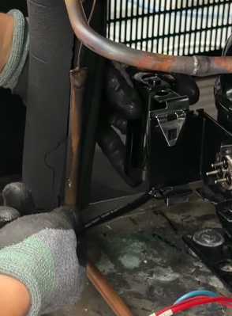

② 기존 배선 순서에 맞춰 배선을 연결합니다. 기존 배선과 동일한 위치에 연결한 후, 새 부품의 단자에 배선을 용접하여 고정합니다.

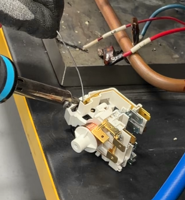

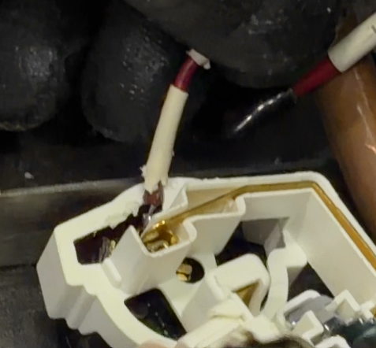

③ **하단 패드**를 장착합니다.

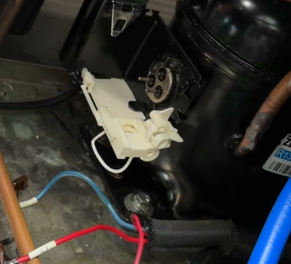

④ 배선을 모두 연결한 후 **보호 커버**를 장착하여 조립을 완료합니다.

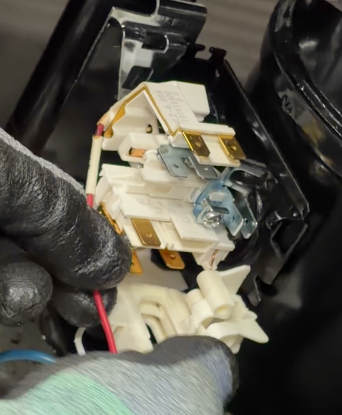

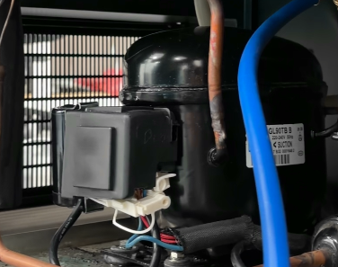

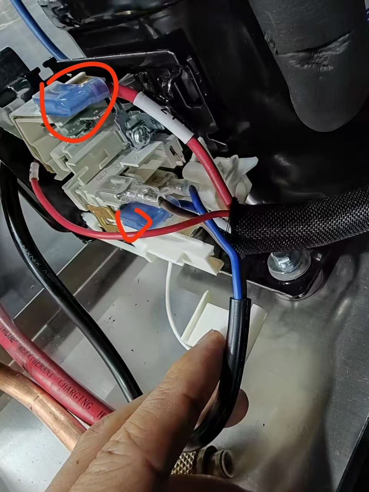

위 사진은 배선 연결이 완료된 상태입니다.

## 냉매 충전



## 냉매 가스 연결

이제 냉매를 정식으로 충전합니다. 먼저 진공펌프에 연결되어 있던 **노란색 호스**를 분리한 후, 냉매 가스에 다시 연결합니다.



## 냉매 위치 조정

냉매를 충전할 때에는 **냉매 용기를 눕힌 상태**로 충전하는 것이 더욱 원활하게 냉매를 공급할 수 있습니다.

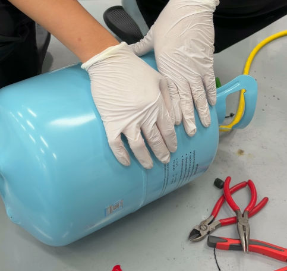



## 호스 내부 공기 배출

냉매 밸브를 열기 전에, 노란색 호스 중앙의 밸브를 먼저 풀어줍니다. 그 후 뾰족한 공구를 이용하여 **밸브 코어(Valve Core)** 를 눌러 호스 내부에 남아 있는 공기를 충분히 배출합니다.



## 냉매 충전

공기 배출이 완료되면 파란색 저압 밸브를 천천히 개방합니다. 냉매는 **열기 → 닫기 → 다시 열기** 를 반복하면서 조금씩 충전합니다.



## 냉매 순환 및 안정화

몇 차례 반복하여 냉매를 충전한 후에는, 장비를 일정 시간 운전하여 냉매가 시스템 내부에서 충분히 순환하고 안정화될 수 있도록 합니다.



## 시운전



## 장비 운전

장비를 **RUNNING** 상태로 운전합니다.



## 챔버 온도 확인

챔버 온도가 설정 온도를 정상적으로 유지하는지 확인합니다.



## 냉매 충전량 확인

냉매 압력과 **냉매-압력 기준표**를 비교하여 냉매 충전량이 적정한지 확인합니다.



## 설정 온도별 동작 확인

먼저 \*\*25℃\*\*에서 정상 동작 여부를 확인합니다. 25℃에서 이상이 없으면 \*\*0℃\*\*로 설정하여 온도 제어 상태와 냉매 압력이 모두 정상인지 다시 확인합니다.



## 최종 판단

최종 판단은 아래의 **냉매 압력 기준표**를 참고하여 확인합니다.


**냉매 압력 기준표**를 확인할 수 없는 경우에는, 냉매 충전량을 **약 400g** 기준으로 충전하여 작업을 진행하시기 바랍니다.




### 냉매 충전 기준

장비의 설정 온도에 따라 아래의 **냉매 압력 기준표**를 참고하여 냉매를 충전하시기 바랍니다.

| 설정 온도     | 운전 시간 | 전류(A)      | 냉매 압력(kg/cm²) |
| --------- | ----- | ---------- | ------------- |
| 30℃ – 25℃ | 3:01  | **2.47 A** | **1.7 kg**    |
| 25℃ – 20℃ | 3:30  | **2.42 A** | **1.6 kg**    |
| 20℃ – 15℃ | 5:05  | **2.40 A** | **1.5 kg**    |
| 15℃ – 10℃ | 8:02  | **2.40 A** | **1.2 kg**    |
| 10℃ – 8℃  | 3:32  | **2.40 A** | **1.2 kg**    |
| 8℃ – 6℃   | 4:18  | **2.37 A** | **1.1 kg**    |
| 6℃ – 4℃   | 5:43  | **2.37 A** | **1.1 kg**    |
| 4℃ – 2℃   | 7:40  | **2.30 A** | **1.0 kg**    |
| 2℃ – 1℃   | 5:10  | **2.30 A** | **1.0 kg**    |
| 1℃ – 0℃   | 7:11  | **2.30 A** | **0.9 kg**    |

**※ 참고사항**

1. 냉매는 **R134a**를 사용하며, 권장 충전량은 **280\~300g**입니다.
2. **30분 이상 운전한 후**, 각 배관 연결부의 냉매 누설 여부를 다시 확인하시기 바랍니다.
3. **압력 게이지를 사용할 수 없는 경우에는 냉매를 약 400g 충전하는 것을 기준으로 작업을 진행하시기 바랍니다.**
